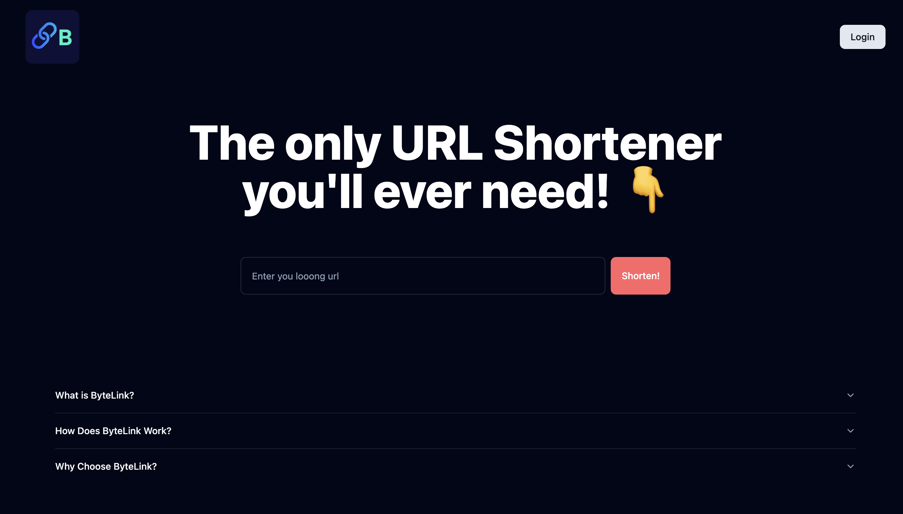
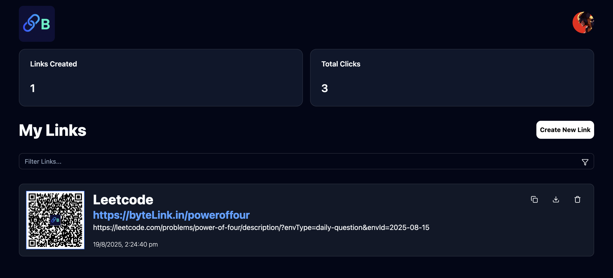
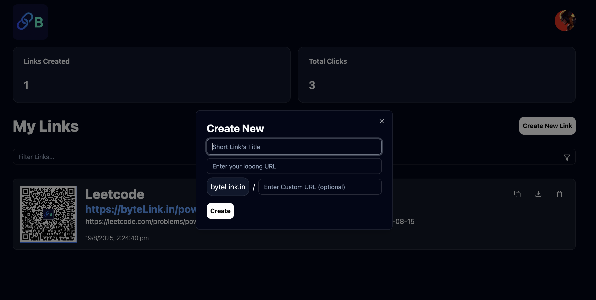

# 🌐 ByteLink - URL Shortener with Analytics

ByteLink is a full-stack URL shortener application that allows users to create, manage, and analyze their links.  
It provides real-time analytics, QR code generation, and a modern dashboard to track clicks, location insights, and device usage.

---

## ✨ Features

- 🔗 **URL Shortening**: Generate short links with optional custom aliases.  
- 📊 **Analytics Dashboard**: Track total clicks, city-wise insights, and device distribution (mobile/desktop).  
- 🖼 **QR Code Support**: Automatic QR code generation for every shortened link with options to copy or download.  
- 👤 **User Authentication**: Sign up/login functionality with secure session management.  
- 📂 **User Dashboard**: View all links created, total clicks, and manage them with ease.  
- 🗑 **Account Deletion**: Users can delete their account, which removes all associated data (profile pic, links, analytics).  
- 🎨 **Modern UI**: Built with **TailwindCSS** and **Shadcn** for a smooth and responsive experience.  

---

## 🛠 Tech Stack

- **Frontend**: Vite, React.js, TypeScript  
- **UI/Styling**: TailwindCSS, Shadcn  
- **Backend/Database**: Supabase (Authentication, Storage, Database)  
- **Charts & Analytics**: Recharts (line charts, pie charts)  

---

## 📸 Screenshots

### 🚀 Landing Page

### 🔐 Login / Signup Page

### 📂 My Links Page

### 📂 Create New Link

### 📊 Link Statistics Page

---
